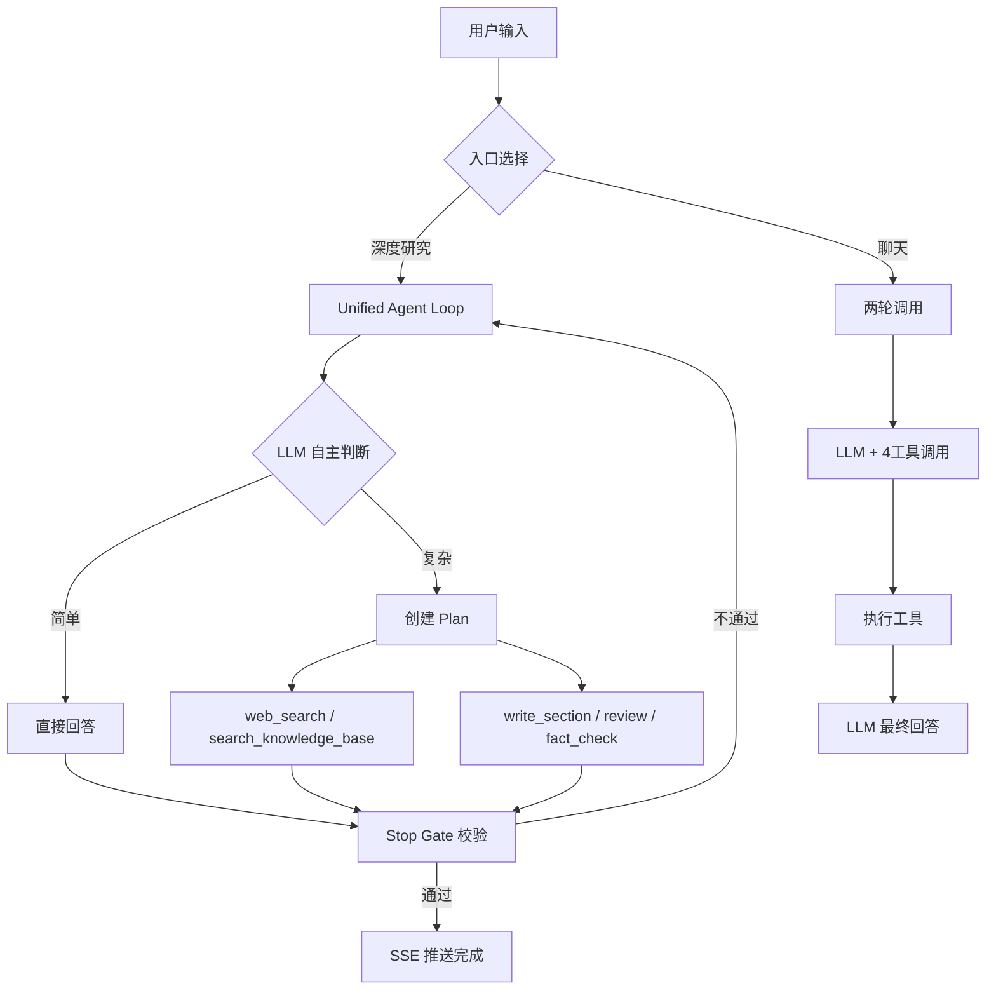

# AI Research Copilot

单 Agent 多工具自主研究与报告生成系统。

> 输入一个复杂研究主题 → Agent 自主规划 → 调用搜索/分析/写作等 9 个工具 → 生成结构化报告 → 质量审核 → 导出。
> 全程 **SSE 实时推送进度**，每一步思考可见。

传统人工研究一个课题耗时 4-8 小时，AI Research Copilot 压缩到 **2-5 分钟**，且每一步思考过程实时可见。

📺 **项目介绍视频**：[Bilibili 主页](https://space.bilibili.com/494206751)

---

## 架构概览

项目提供两个入口，底层架构不同：

| 入口 | 架构 | 可用工具 | 特点 |
|------|------|---------|------|
| **深度研究** `POST /api/research/stream` | UnifiedAgentLoop 自循环 + Stop Gate | 全部 9 个 | 自主迭代、质量校验、SSE 实时推送 |
| **聊天** `POST /api/chat` | 固定两轮调用（工具→回答） | 4 个（搜索+记忆） | 快速响应、自动记忆检索、对话存档 |



### 核心设计

**Unified Agent Loop** — LLM 在循环中自主决定下一步做什么，不固定管线：

- 简单问题（"什么是 RESTful API？"）→ 直接回答，0 次工具调用，< 2 秒
- 中等复杂（"搜索最新 AI 新闻"）→ 搜索 → 分析 → 回答，3-5 次工具调用
- 高度复杂（"分析新能源汽车市场趋势"）→ 规划 → 搜索×3 → 分析×2 → 撰写 → 审核，完整流程

**Stop Gate** — 本地规则校验，不额外调 LLM。检查内容长度、章节完整性、来源引用等 5 项指标，不通过则追加反馈让 Agent 修正。

**三阶段混合检索** — Dense 向量(BGE) + Sparse BM25(jieba) → RRF 融合 → Cross-Encoder Reranker 精排。经多轮人工测试（精确检索、语义区分、否定逻辑等 8 个维度），检索质量相比纯向量检索有明显提升。

**RAG Trace 实时监测** — 每次检索工具调用时，SSE 推送结构化 Trace 数据（每个片段的相关度分数、来源文件、检索管线、质量评级），Agent 时间线中渲染可展开的检索质量卡片。多因子低相关度检测（绝对分数 < 0.3 或分数分布坍塌），低质量时卡片红色脉冲警告，Agent 自动切换 web_search。CrossEncoder v5.x 分数已在 [0,1] 区间，≥0.7 可靠匹配 / <0.3 不相关。

---

## 功能特性

### 两种研究模式

| 模式 | 入口 | 架构 | 适用场景 |
|------|------|------|---------|
| **深度研究** | `POST /api/research/stream` | UnifiedAgentLoop 自循环，9 工具 | 复杂报告、市场分析、技术调研，需分章节+引用+审核 |
| **聊天** | `POST /api/chat` | 独立两轮调用（工具→回答），4 工具 | 快速问答、实时信息、知识库检索、日常对话 |

聊天模式下若用户要求生成分析报告，System Prompt 会引导其切换到深度研究模式，避免在聊天中用不完整的工具链勉强输出低质量长文。

### Agent 工具链

**深度研究模式（9 个工具）**：

| 工具 | 功能 |
|------|------|
| `create_plan` / `update_plan` | 拆解复杂任务 + 跟踪步骤状态 |
| `web_search` | Tavily API 互联网搜索 |
| `search_knowledge_base` | 三阶段混合检索本地知识库 |
| `write_section` | 撰写结构化报告章节 |
| `review_section` | 4 维度章节质量评审（准确性/完整性/可读性/格式） |
| `fact_check` | 事实声明交叉验证，标注可信度 |
| `save_memory` | 持久记忆存取（双写：文件 + ChromaDB） |

**聊天模式（4 个工具）**：`web_search`、`search_knowledge_base`、`recall_memory`、`save_memory`。聊天不具备 Plan/Write/Review/FactCheck 能力，复杂报告任务由 System Prompt 引导用户切换到深度研究。

### 记忆系统

借鉴 Claude Code Memory 设计，四层记忆模型：

```
工作记忆 (AgentState) → 情节记忆 (ChromaDB + 文件) → 语义记忆 (向量检索) → 程序记忆 (System Prompt)
```

- **聊天模式记忆**：每条消息自动检索对话历史（`chat_history`）+ 持久记忆（`agent_memory`），注入 System Prompt。对话自动存档，上限 500 条自动淘汰。
- **聊天记忆时间衰减**：召回时对历史对话应用指数时间衰减（24h 半衰期），检测"刚才/今天"等时间限定词，超过 72h 的旧记录自动过滤，避免旧对话干扰当前上下文
- **深度研究记忆**：不自动注入持久记忆，内容来源锁定为知识库切片 + 网络搜索结果。研究结论通过 `auto_save_research()` 自动归档到 `agent_memory`，供聊天模式检索
- **短期/长期记忆分工**：`chat_history` 负责近期上下文缓存（有限条数+时间衰减），`agent_memory` 负责用户偏好和研究结论的永久存储

### 知识库 RAG

- 支持 PDF / TXT / Markdown 上传
- 三阶段混合检索：Dense + BM25 → RRF → Reranker
- **RAG Trace 可视化**：每次检索在时间线中展示每个片段的相关度分数、来源文件、检索管线（Dense+BM25→RRF→Reranker）、质量评级（good/borderline/poor），低相关度时卡片红色脉冲警告，Agent 自动切换 web_search
- 多因子低相关度检测：绝对分数 < 0.3 或分数分布坍塌（spread < 0.08）触发红色警告，Score Collapse 检测防止模型无法区分时的误判
- 低相关度自动兜底：检索质量不足时 System Prompt 强制 Agent 调用 `web_search`，禁止基于不相关文档编造答案
- 前端拖拽上传 + 文件管理（列表 + 删除）

---

## 技术栈

| 层 | 技术 | 说明 |
|---|------|------|
| **前端** | React 19 + TypeScript + Vite + TailwindCSS 4 + Ant Design 6 | SSE 消费用浏览器原生 `fetch` + `ReadableStream` |
| **后端** | Python 3.13 + FastAPI + Uvicorn | 原生 async，自动 OpenAPI 文档 |
| **LLM** | DeepSeek V3（兼容 OpenAI SDK） | 中文能力强、成本低 |
| **ORM** | SQLAlchemy 2.0 + SQLite | 2.0 风格 `select()`，WAL 模式 |
| **向量库** | ChromaDB (PersistentClient) | 本地运行，零配置 |
| **Embedding** | BAAI/bge-large-zh-v1.5 (1024维) | 中英文混合语义理解 |
| **Reranker** | BAAI/bge-reranker-v2-m3 (Cross-Encoder) | 精排重排序 |
| **搜索** | Tavily Search API | 每月 1000 次免费 |

---

## 快速开始

### 环境要求

- Python 3.12+
- Node.js 22+
- DeepSeek API Key（[注册获取](https://platform.deepseek.com/)）
- Tavily API Key（[注册获取](https://tavily.com/)，每月 1000 次免费）

### 方式一：Docker Compose（推荐，一键启动）

```bash
# 1. 配置环境变量
cp .env.example .env
# 编辑 .env，填入 DEEPSEEK_API_KEY 和 TAVILY_API_KEY

# 2. 一键启动（首次启动会下载模型，约 3GB，需耐心等待）
docker compose up -d

# 3. 打开浏览器
# http://localhost:5173
```

首次启动时，BGE 模型（embedding ~1.3GB + reranker ~1.8GB）会自动从 HuggingFace 下载到容器内的 `/app/data/models/`。模型下载完成后服务即可正常使用。

### 方式二：本地开发

```bash
# 1. 配置环境变量
cp .env.example .env
# 编辑 .env，填入 DEEPSEEK_API_KEY 和 TAVILY_API_KEY

# 2. 启动后端（终端 1）
cd backend
pip install -r requirements.txt
python main.py
# → Backend 运行在 http://localhost:8000
# → API 文档：http://localhost:8000/docs

# 3. 启动前端（终端 2）
cd frontend
npm install
npm run dev
# → Frontend 运行在 http://localhost:5173

# 4. 打开浏览器访问 http://localhost:5173
```

---

## API 文档

启动后端后访问 **Swagger UI**：`http://localhost:8000/docs`

### 端点一览

```
POST   /api/chat                    # 聊天模式（含自动记忆检索 + 对话存档）
GET    /api/chat/health             # 健康检查

POST   /api/research/stream         # SSE 流式研究（核心端点）
POST   /api/research/sync           # 同步研究（返回完整结果，无 SSE）

GET    /api/history                 # 历史报告列表
GET    /api/history/{id}            # 历史报告详情
DELETE /api/history/{id}            # 删除单个历史报告
DELETE /api/history                 # 清空全部历史报告

POST   /api/knowledge/upload        # 上传文档到知识库
GET    /api/knowledge/stats         # 知识库统计信息
GET    /api/knowledge/files         # 列出已上传文件
DELETE /api/knowledge/files/{name}  # 删除知识库文件
```

### 核心请求示例

```json
// POST /api/research/stream
{
    "task": "分析2026年新能源汽车市场趋势，重点关注比亚迪和特斯拉的竞争格局",
    "options": {
        "depth": "deep",
        "sources": ["web", "knowledge_base"],
        "language": "zh-CN",
        "max_sections": 5
    }
}
```

SSE 事件流响应：

```
data: {"type":"task_started","timestamp":"..."}
data: {"type":"plan_created","steps":[...]}
data: {"type":"step_started","step_id":"1"}
data: {"type":"tool_executed","tool":"web_search","result_preview":"..."}
data: {"type":"step_completed","step_id":"1"}
...
data: {"type":"complete","report":"# 2026年新能源汽车市场分析报告\n\n## 一、市场概况\n..."}
```

### `depth` 参数

| 值 | 行为 |
|----|------|
| `quick` | 只允许 `web_search` + 直接回答，不走 Plan，最多 3 轮迭代 |
| `auto`（默认） | LLM 自主判断复杂度（零成本预检辅助） |
| `deep` | 完整工具链可用，允许 `create_plan` 拆解执行 |

---

## 项目结构

```
ai-research-copilot/
├── backend/
│   ├── main.py                    # FastAPI 入口，lifespan 初始化
│   ├── config.py                  # 配置管理（.env → dataclass）
│   ├── database.py                # SQLAlchemy 2.0 ORM
│   ├── llm_client.py              # LLM 客户端工厂（OpenAI 兼容）
│   ├── requirements.txt
│   ├── Dockerfile
│   ├── api/                       # API 路由
│   │   ├── chat.py                #   POST /api/chat
│   │   ├── research.py            #   POST /api/research/stream + /sync
│   │   ├── history.py             #   GET/DELETE /api/history
│   │   └── knowledge.py           #   POST/GET/DELETE /api/knowledge
│   ├── agent_engine/              # Agent 核心引擎
│   │   ├── loop.py                #   UnifiedAgentLoop + StopGate
│   │   ├── state.py               #   AgentState + PlanStep 数据结构
│   │   ├── prompt.py              #   System Prompt（行为规则 + 复杂度判断 + 数据分析指南）
│   │   ├── memory.py              #   记忆管理（文件 + ChromaDB + 对话存档）
│   │   ├── router.py              #   quick_classify() 复杂度预检
│   │   └── sse_emitter.py         #   SSE 事件发射器
│   ├── tools/                     # Agent 工具层（9 个工具）
│   │   ├── registry.py            #   ToolRegistry 装饰器注册中心
│   │   ├── search.py              #   web_search (Tavily)
│   │   ├── analyze.py             #   分析模板（System Prompt 指南）
│   │   ├── plan.py                #   create_plan + update_plan
│   │   ├── write.py               #   write_section
│   │   ├── memory.py              #   save_memory + recall_memory
│   │   ├── knowledge.py           #   search_knowledge_base
│   │   └── review.py              #   review_section + fact_check
│   └── vector/                    # ChromaDB 向量基础设施
│       └── __init__.py            #   3 collections + BM25 + RRF + Reranker
├── frontend/
│   ├── vite.config.ts
│   ├── package.json
│   ├── Dockerfile
│   └── src/
│       ├── App.tsx                # 主应用（聊天/研究双模式 + 历史面板）
│       ├── api/client.ts          # API 封装
│       ├── components/
│       │   ├── AgentTimeline.tsx  #   时间线 + ReportViewer + ExportButton
│       │   ├── HistoryPanel.tsx   #   历史记录侧边面板
│       │   └── KnowledgeUpload.tsx #  知识库拖拽上传
│       ├── hooks/
│       │   └── useResearchStream.ts # SSE 消费 Hook
│       └── types/
│           └── index.ts           # TypeScript 类型定义
├── memory/                        # 记忆文件存储
├── data/                          # SQLite + ChromaDB 持久化（自动创建）
├── docker-compose.yml
├── .env.example
├── .gitignore
└── README.md
```

---

## 配置说明

复制 `.env.example` 为 `.env` 并填入实际值：

```bash
# ---------- LLM（必填）----------
DEEPSEEK_API_KEY=sk-your-key-here        # DeepSeek API Key
DEEPSEEK_BASE_URL=https://api.deepseek.com
DEEPSEEK_MODEL=deepseek-chat

# ---------- 搜索（必填）----------
TAVILY_API_KEY=tvly-your-key-here        # Tavily Search API Key

# ---------- 服务器 ----------
HOST=0.0.0.0
PORT=8000
CORS_ORIGINS=http://localhost:5173,http://127.0.0.1:5173

# ---------- 数据库 ----------
DATABASE_URL=sqlite:///./data/research.db
CHROMA_PERSIST_DIR=./data/chroma

# ---------- Agent ----------
MAX_ITERATIONS=20                        # 最大迭代轮数
TOOL_TIMEOUT_SECONDS=30                  # 单个工具超时
```

---

## 开发状态

- [x] **Phase 0**：项目骨架（FastAPI + React + DeepSeek 调通）
- [x] **Phase 1**：Agent Engine（Unified Loop + Tool Registry + Stop Gate）
- [x] **Phase 2**：SSE 流式 + 前后端打通（时间线 + 报告渲染 + 导出 + 历史）
- [x] **Phase 3**：进阶功能（RAG 知识库 + 记忆系统 + 质量审核 + UI 打磨）
- [x] **Phase 4**：Docker 部署 + 文档完善

## 示例数据

### 深度研究测试用例

`Project_Review/深度研究测试用例/` 下提供 6 份检索知识库文档 + 25 条 RAG 测试用例，覆盖 8 个测试维度，用于验证三阶段混合检索（Dense + BM25 → RRF → Reranker）的检索质量。

| 文件 | 类型 | 字数 | 核心测试维度 |
|------|------|------|-------------|
| `01_企业架构设计规范_v3.2.md` | 技术规范文档 | ~2500 | 精确数字/版本匹配、规范条款检索 |
| `02_Python异步编程最佳实践.md` | 技术教程 | ~2200 | 代码片段检索、中英混合、错误码匹配 |
| `03_Q3季度产品迭代总结.md` | 会议/报告 | ~2000 | 数字指标检索、人名/项目名匹配 |
| `04_微服务与单体架构对比分析.md` | 架构决策记录 | ~2200 | 语义区分、否定条件、决策理由检索 |
| `05_数据安全合规检查清单.md` | 清单/表格 | ~1500 | 结构化内容检索、严重级别匹配 |
| `06_AI_Agent技术选型决策记录.md` | 技术决策记录 | ~2000 | 对比论证检索、"为什么选A不选B" |

#### 测试覆盖

| 类别 | 测试点 | 数量 |
|------|--------|------|
| 精确事实检索 | 版本号、数字、人名精准定位 | 5 |
| 语义理解与区分 | 相似文档精准区分 | 5 |
| 代码与精确字符串 | 错误信息、API 名称精确匹配 | 3 |
| 跨文档综合 | 多文档信息综合回答 | 4 |
| 否定与条件逻辑 | 否定词、条件判断理解 | 3 |
| 同义表达/改写 | 口语化查询匹配文档术语 | 3 |
| 中英混合 | 中英术语混合查询不干扰 | 2 |
| 边界与压力 | 空结果、极短查询、单关键词 | 5 |

详细测试用例见 [Project_Review/深度研究测试用例/README_测试用例说明.md](Project_Review/深度研究测试用例/README_测试用例说明.md)（含 25 道测试题、评分标准、评估指标 Recall@3/MRR、已知架构弱点分析）。

### 检索知识库

`Project_Review/深度研究测试用例/检索知识库/` 下提供 6 份行业知识文档，覆盖企业架构、Python 异步编程、产品迭代、架构决策、数据安全、AI Agent 选型等领域。上传到项目知识库后即可跑通全部 25 条测试用例，量化评估 RAG 检索质量。

## License

MIT
